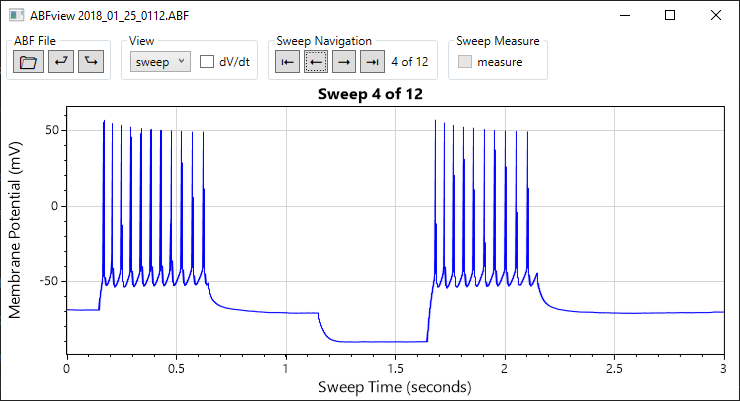

# ABFview

**ABFview is an electrophysiology data viewer for Axon Binary Format (ABF) files.** ABFview was created to be a free alternative to ClampFit to _view_ ABF files, however it can be modified to perform custom analysis tasks as needed. Unlike ClampFit, ABFview never locks files so ABFs on network drives can be viewed by multiple computers simultaneously.

### Download
* Click-to-run EXE: **[ABFview.zip](/download)**

### Additional Resources
* [pyABF](https://github.com/swharden/pyABF) is a pure-Python interface for ABF files
* [ABFsharp](https://github.com/swharden/ABFsharp) is a .NET interface for ABF files
* ClampFit (the official software to analyze ABF files) is developed by Molecular Devices and sold as part of the [pCLAMP Software Suite](https://www.moleculardevices.com/products/axon-patch-clamp-system/acquisition-and-analysis-software/pclamp-software-suite)